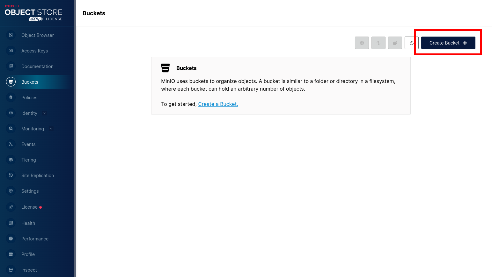
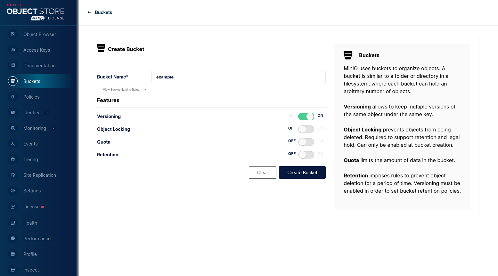
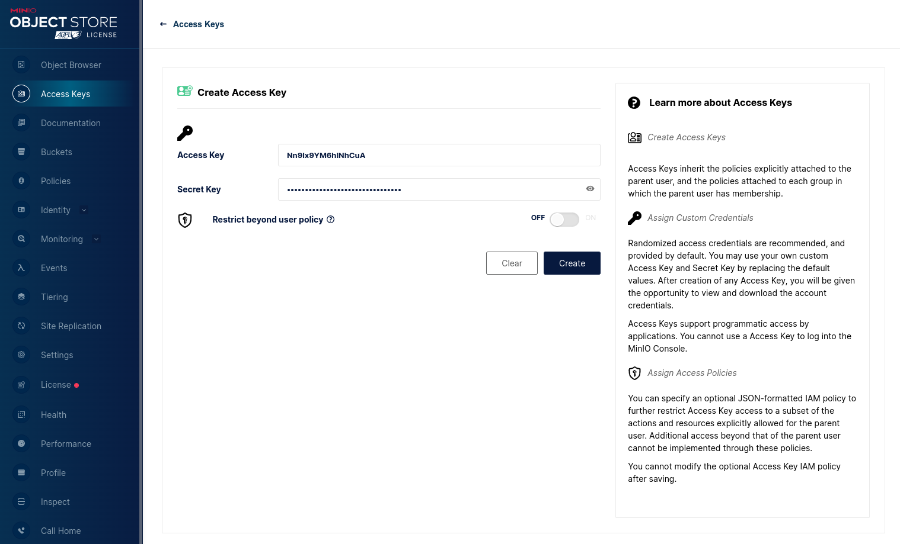

# Setup Minio for local development

The minio admin can be found on `http://localhost:9090` with the username and password of the following. This can be changed within the `docker-compose.yml` file in necessary.

```
username: minioadmin
password: minioadmin
```

Once inside the admin dashboard create a bucket.





This image is just an example of the bucket, versioning is an optional configuration. If left off, new files with the same name will be replaced rather than being stored.

Now you must create a service account and use the access and secret keys within the application.



After creation, the minio dashboard will give you an access key and service key to use the service account. Be sure to add it to the minio client configuration, found in `/server/src/lib/minio.ts`. For now we are hardcoding it into the application during the early stages of development but later it should be stored in an .env file.

> TODO: update this markdown file when environment files are properly setup.

```typescript
export const minio = new Minio.Client({
  endPoint: "localhost",
  port: 9000,
  accessKey: "<add access key here>",
  secretKey: "<add secret key here>",
  useSSL: false, // setting useSSL to false will mean we can communicate to the minio server using http, setting to true will change it to https
});
```
